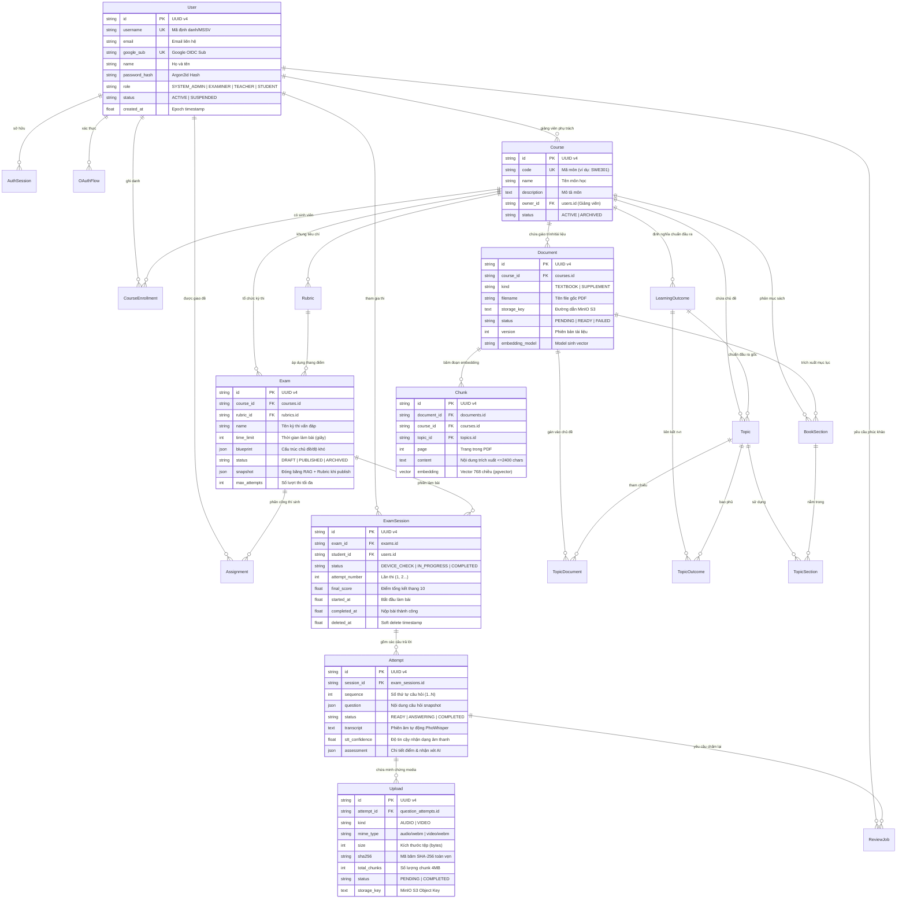

# ĐẶC TẢ THIẾT KẾ CƠ SỞ DỮ LIỆU (DATABASE ARCHITECTURE & DATA DICTIONARY)

> **Dự án:** AI Oral Assessment Platform (Hệ thống Thi vấn đáp Tự động bằng AI)  
> **Chủ sở hữu:** Bình (Nguyễn Văn Gia Bình) — NCKH / Đồ án Tốt nghiệp  
> **Hệ quản trị CSDL:** PostgreSQL 16 tích hợp Extension `pgvector`  
> **Lưu trữ nhị phân (Object Storage):** MinIO S3 (Audio / Video bài thi và Giáo trình PDF)  
> **Bộ nhớ đệm (In-Memory Cache):** Redis 7 (Rate limiting, Celery task queue, Pub/Sub)  
> **ORM Framework:** SQLAlchemy 2.0 (Python 3.12+) & Migration qua Alembic  

---

## 1. TỔNG QUAN KIẾN TRÚC DỮ LIỆU & RÀNG BUỘC TOÀN CỤC

Cơ sở dữ liệu của hệ thống được thiết kế theo chuẩn **3NF (Third Normal Form)**, kết hợp linh hoạt với các trường `JSONB` có cấu trúc phục vụ việc đóng băng đề thi (**Exam Snapshot Versioning**) và trường vector đa chiều phục vụ mô hình tìm kiếm ngữ nghĩa (**pgvector**).

### 1.1. Các nguyên tắc kiến trúc dữ liệu cốt lõi (Data Architectural Invariants)
1. **Server là Source of Truth:** Toàn bộ điểm số, phiên thi (`exam_sessions`), câu hỏi và kết quả thẩm định đều được tính toán và kiểm soát tập trung tại server.
2. **Khóa chính chuẩn hóa (UUID v4):** 100% các bảng kế thừa lớp cơ sở `Entity` đều sử dụng khóa chính UUID v4 dạng chuỗi 36 ký tự (`String(36)`) kèm thời gian khởi tạo Unix epoch (`created_at: Float`) giúp phân tán dữ liệu và chống đoán ID.
3. **Đóng băng tri thức (Freeze Snapshot):** Khi đề thi chuyển trạng thái `PUBLISHED`, toàn bộ cây giáo trình RAG, danh sách tiêu chí Rubric và cấu hình model AI tại thời điểm đó được copy nguyên trạng vào cột `snapshot` (JSON). Mọi thay đổi giáo trình sau đó không làm sai lệch kết quả chấm của các bài thi đã công bố.
4. **Không tin tưởng Client (Anti-Tampering):** Máy trạm sinh viên chỉ đẩy các mảnh file âm thanh thô 4MB có băm SHA-256 lên MinIO. Bảng `uploads` lưu trữ hash và trạng thái upload; bảng `question_attempts` lưu transcript do Worker tự động bóc băng từ MinIO (Zero-STT Client).

---

## 2. SƠ ĐỒ THỰC THỂ LIÊN KẾT TỔNG THỂ (ENTITY-RELATIONSHIP DIAGRAM - ERD)



---

## 3. PHÂN CỤM DỮ LIỆU THEO MIỀN NGHIỆP VỤ (DOMAIN DECOMPOSITION)

Cơ sở dữ liệu gồm **23 bảng**, được chia thành 4 miền nghiệp vụ rõ rệt:

```
[HỆ THỐNG CƠ SỞ DỮ LIỆU POSTGRESQL + PGVECTOR]
 ├── MIỀN 1: TÀI KHOẢN, PHÂN QUYỀN & XÁC THỰC (Identity & Access Management)
 │     ├── users
 │     ├── auth_sessions
 │     └── oauth_flows
 ├── MIỀN 2: QUẢN LÝ ĐÀO TẠO, GIÁO TRÌNH & RAG ENGINE (Course, Syllabus & Vector DB)
 │     ├── courses
 │     ├── course_enrollments
 │     ├── learning_outcomes
 │     ├── topics
 │     ├── documents
 │     ├── document_chunks (pgvector 768D)
 │     ├── book_sections
 │     ├── topic_outcomes (bảng liên kết N-N)
 │     ├── topic_sections (bảng liên kết N-N)
 │     └── topic_documents (bảng liên kết N-N)
 ├── MIỀN 3: TỔ CHỨC THI VẤN ĐÁP & CHẤM ĐIỂM AI (Assessment, Anti-Tampering & Grading)
 │     ├── rubrics
 │     ├── exams
 │     ├── assignments
 │     ├── exam_sessions
 │     ├── question_attempts
 │     ├── uploads (MinIO evidence)
 │     ├── review_jobs (phúc khảo)
 │     └── media_cleanup
 └── MIỀN 4: GIÁM SÁT HỆ THỐNG & CẤU HÌNH ĐỘNG (Audit Trail & System Config)
       ├── audit_logs
       └── system_settings
```

---

## 4. TỪ ĐIỂN DỮ LIỆU CHI TIẾT (DATA DICTIONARY)

### 4.1. Miền 1: Tài khoản, Phân quyền & Xác thực (Identity & Access Management)

#### 1. Bảng `users` (Quản lý người dùng toàn hệ thống)
*Lưu trữ thông tin định danh, tài khoản cục bộ và liên kết Google SSO cho cả 4 vai trò.*

| Tên trường | Kiểu dữ liệu | Khóa / Ràng buộc | Giá trị mặc định | Diễn giải nghiệp vụ |
| :--- | :--- | :---: | :---: | :--- |
| `id` | `VARCHAR(36)` | **PK** | UUID v4 | Khóa chính duy nhất định danh người dùng. |
| `username` | `VARCHAR(80)` | **UNIQUE, NOT NULL** | — | Tên đăng nhập hoặc Mã số sinh viên (MSSV, ví dụ: `SE180001`). |
| `email` | `VARCHAR(320)` | `NULLABLE` | `NULL` | Hòm thư điện tử (phục vụ thông báo kết quả thi hoặc SSO). |
| `google_sub` | `VARCHAR(255)` | **UNIQUE, NULLABLE** | `NULL` | Mã định danh duy nhất người dùng từ Google OIDC (`sub` claim). |
| `name` | `VARCHAR(150)` | `NOT NULL` | — | Họ và tên hiển thị của người dùng (Ví dụ: "Nguyễn Văn Gia Bình"). |
| `password_hash`| `TEXT` | `NOT NULL` | — | Mật khẩu băm an toàn chuẩn **Argon2id** (memory=64MB, t=3, p=4). |
| `role` | `VARCHAR(20)` | `NOT NULL` | `'STUDENT'` | 1 trong 4 vai trò chuẩn: `SYSTEM_ADMIN`, `EXAMINER`, `TEACHER`, `STUDENT`. |
| `status` | `VARCHAR(20)` | `NOT NULL` | `'ACTIVE'` | Trạng thái tài khoản: `ACTIVE` (hoạt động), `SUSPENDED` (bị khóa). |
| `created_at` | `DOUBLE PRECISION`| `NOT NULL` | `time.time()` | Thời điểm tạo tài khoản (Unix epoch seconds). |

#### 2. Bảng `auth_sessions` (Phiên đăng nhập & Thu hồi Token)
*Quản lý danh sách đen và thu hồi token JWT khi người dùng đăng xuất.*

| Tên trường | Kiểu dữ liệu | Khóa / Ràng buộc | Giá trị mặc định | Diễn giải nghiệp vụ |
| :--- | :--- | :---: | :---: | :--- |
| `id` | `VARCHAR(36)` | **PK** | UUID v4 | Khóa chính của phiên đăng nhập. |
| `user_id` | `VARCHAR(36)` | **FK -> users.id** | — | ID người dùng sở hữu phiên đăng nhập. |
| `token_hash` | `VARCHAR(64)` | **UNIQUE, NOT NULL** | — | Mã băm SHA-256 của JWT Bearer token (không lưu raw token). |
| `expires_at` | `DOUBLE PRECISION`| `NOT NULL` | — | Thời điểm token hết hạn. |
| `revoked` | `BOOLEAN` | `NOT NULL` | `FALSE` | Đánh dấu `TRUE` khi người dùng bấm Đăng xuất để vô hiệu hóa token. |
| `created_at` | `DOUBLE PRECISION`| `NOT NULL` | `time.time()` | Thời điểm cấp phát phiên. |

#### 3. Bảng `oauth_flows` (Luồng đăng nhập Google OIDC PKCE)
*Kiểm soát quá trình bắt tay OAuth2 với Google đảm bảo an toàn chống CSRF.*

| Tên trường | Kiểu dữ liệu | Khóa / Ràng buộc | Giá trị mặc định | Diễn giải nghiệp vụ |
| :--- | :--- | :---: | :---: | :--- |
| `id` | `VARCHAR(36)` | **PK** | UUID v4 | Khóa chính phiên OAuth. |
| `state_hash` | `VARCHAR(64)` | **UNIQUE, NULLABLE** | `NULL` | Băm SHA-256 của chuỗi state chống giả mạo CSRF. |
| `nonce` | `VARCHAR(100)` | `NOT NULL` | — | Chuỗi ngẫu nhiên kiểm tra replay attack trong OIDC token. |
| `verifier` | `VARCHAR(100)` | `NOT NULL` | — | Code Verifier cho chuẩn PKCE. |
| `poll_hash` | `VARCHAR(64)` | `NULLABLE` | `NULL` | Mã định danh client polling khi dùng login SSO trên Desktop. |
| `user_id` | `VARCHAR(36)` | **FK -> users.id** | `NULL` | User được liên kết sau khi đăng nhập thành công. |
| `expires_at` | `DOUBLE PRECISION`| `NOT NULL` | — | Thời hạn của phiên bắt tay OAuth (thường 5-10 phút). |
| `consumed` | `BOOLEAN` | `NOT NULL` | `FALSE` | Đánh dấu phiên đã được xử lý xong. |
| `completed` | `BOOLEAN` | `NOT NULL` | `FALSE` | Trạng thái đăng nhập thành công. |
| `failed` | `BOOLEAN` | `NOT NULL` | `FALSE` | Trạng thái phiên bị hủy hoặc lỗi. |
| `created_at` | `DOUBLE PRECISION`| `NOT NULL` | `time.time()` | Thời điểm tạo request OAuth. |

---

### 4.2. Miền 2: Quản lý Đào tạo, Giáo trình & Động cơ RAG (Course, Syllabus & Vector DB)

#### 4. Bảng `courses` (Danh mục môn học)
*Môn học do Cán bộ Khảo thí (`EXAMINER`) tạo ra và phân công cho Giảng viên (`TEACHER`) phụ trách.*

| Tên trường | Kiểu dữ liệu | Khóa / Ràng buộc | Giá trị mặc định | Diễn giải nghiệp vụ |
| :--- | :--- | :---: | :---: | :--- |
| `id` | `VARCHAR(36)` | **PK** | UUID v4 | Khóa chính duy nhất của môn học. |
| `code` | `VARCHAR(50)` | **UNIQUE, NOT NULL** | — | Mã môn học chuẩn (Ví dụ: `SWE301`, `PRN231`). |
| `name` | `VARCHAR(200)`| `NOT NULL` | — | Tên môn học (Ví dụ: "Software Architecture and Design"). |
| `description`| `TEXT` | `NOT NULL` | `''` | Mô tả tóm tắt nội dung môn học và yêu cầu kỹ năng. |
| `owner_id` | `VARCHAR(36)` | **FK -> users.id** | — | Giảng viên phụ trách môn học (Role: `TEACHER`). |
| `status` | `VARCHAR(20)` | `NOT NULL` | `'ACTIVE'` | Trạng thái môn: `ACTIVE` (đang dạy), `ARCHIVED` (lưu trữ). |
| `created_at` | `DOUBLE PRECISION`| `NOT NULL` | `time.time()` | Ngày tạo môn học trên hệ thống. |

#### 5. Bảng `course_enrollments` (Ghi danh sinh viên vào lớp học phần)
*Bảng liên kết N-N xác định sinh viên nào được phép học và thi môn nào.*

| Tên trường | Kiểu dữ liệu | Khóa / Ràng buộc | Giá trị mặc định | Diễn giải nghiệp vụ |
| :--- | :--- | :---: | :---: | :--- |
| `id` | `VARCHAR(36)` | **PK** | UUID v4 | Khóa chính bản ghi ghi danh. |
| `course_id` | `VARCHAR(36)` | **FK -> courses.id** | — | Mã môn học được ghi danh. |
| `student_id`| `VARCHAR(36)` | **FK -> users.id** | — | Mã sinh viên tham gia khóa học. |
| `created_at` | `DOUBLE PRECISION`| `NOT NULL` | `time.time()` | Ngày sinh viên được thêm vào môn học. |
| *Constraint* | `UNIQUE` | `(course_id, student_id)` | — | Ngăn chặn việc ghi danh trùng lặp một sinh viên vào cùng môn. |

#### 6. Bảng `learning_outcomes` (Chuẩn đầu ra của môn học - LO)
*Các tiêu chí chuẩn đầu ra kiến thức/kỹ năng cần đạt được sau khi học xong môn.*

| Tên trường | Kiểu dữ liệu | Khóa / Ràng buộc | Giá trị mặc định | Diễn giải nghiệp vụ |
| :--- | :--- | :---: | :---: | :--- |
| `id` | `VARCHAR(36)` | **PK** | UUID v4 | Khóa chính chuẩn đầu ra. |
| `course_id` | `VARCHAR(36)` | **FK -> courses.id** | — | Thuộc môn học nào. |
| `code` | `VARCHAR(50)` | `NOT NULL` | — | Mã chuẩn đầu ra (Ví dụ: `LO1`, `LO2`, `PRACTICE`). |
| `description`| `TEXT` | `NOT NULL` | — | Mô tả chi tiết năng lực sinh viên cần thể hiện. |
| `weight` | `DOUBLE PRECISION`| `NOT NULL` | `1.0` | Trọng số của LO trong cấu trúc điểm môn học. |
| `created_at` | `DOUBLE PRECISION`| `NOT NULL` | `time.time()` | Thời điểm tạo chuẩn đầu ra. |
| *Constraint* | `UNIQUE` | `(course_id, code)` | — | Trong 1 môn học, mã LO không được trùng nhau. |

#### 7. Bảng `topics` (Chủ đề ôn tập & ngân hàng câu hỏi)
*Tập hợp các chủ đề kiến thức gắn với chuẩn đầu ra để AI sinh câu hỏi vấn đáp.*

| Tên trường | Kiểu dữ liệu | Khóa / Ràng buộc | Giá trị mặc định | Diễn giải nghiệp vụ |
| :--- | :--- | :---: | :---: | :--- |
| `id` | `VARCHAR(36)` | **PK** | UUID v4 | Khóa chính của chủ đề. |
| `course_id` | `VARCHAR(36)` | **FK -> courses.id** | — | Môn học chứa chủ đề. |
| `learning_outcome_id` | `VARCHAR(36)` | **FK -> learning_outcomes.id** | — | Chuẩn đầu ra gốc (Legacy/Primary LO). |
| `name` | `VARCHAR(200)`| `NOT NULL` | — | Tên chủ đề (Ví dụ: "Clean Architecture Principles"). |
| `description`| `TEXT` | `NOT NULL` | `''` | Hướng dẫn trọng tâm ôn tập của chủ đề. |
| `created_at` | `DOUBLE PRECISION`| `NOT NULL` | `time.time()` | Thời điểm tạo chủ đề. |

#### 8. Bảng `documents` (Tài liệu giáo trình PDF lưu trên MinIO)
*Lưu trữ metadata của sách giáo trình chính thống hoặc tài liệu bổ sung.*

| Tên trường | Kiểu dữ liệu | Khóa / Ràng buộc | Giá trị mặc định | Diễn giải nghiệp vụ |
| :--- | :--- | :---: | :---: | :--- |
| `id` | `VARCHAR(36)` | **PK** | UUID v4 | Khóa chính định danh tài liệu. |
| `course_id` | `VARCHAR(36)` | **FK -> courses.id** | — | Môn học sử dụng tài liệu. |
| `topic_id` | `VARCHAR(36)` | **FK -> topics.id** | `NULL` | Chủ đề liên kết trực tiếp (nếu có). |
| `kind` | `VARCHAR(20)` | `NOT NULL` | `'SUPPLEMENT'` | Loại: `TEXTBOOK` (Giáo trình chính) hoặc `SUPPLEMENT` (Bổ sung). |
| `page_count` | `INTEGER` | `NULLABLE` | `NULL` | Tổng số trang bóc tách được từ tệp PDF. |
| `filename` | `VARCHAR(250)`| `NOT NULL` | — | Tên file gốc người dùng tải lên (Ví dụ: `CleanArchitecture.pdf`). |
| `storage_key`| `TEXT` | `NOT NULL` | — | Đường dẫn object lưu trữ trên MinIO S3. |
| `status` | `VARCHAR(20)` | `NOT NULL` | `'PENDING'` | Trạng thái: `PENDING`, `PROCESSING`, `READY`, `FAILED`. |
| `version` | `INTEGER` | `NOT NULL` | `1` | Số phiên bản tài liệu (tăng khi cập nhật file sửa lỗi). |
| `error` | `TEXT` | `NULLABLE` | `NULL` | Chi tiết lỗi nếu quá trình bóc tách PDF/sinh vector thất bại. |
| `embedding_model` | `VARCHAR(150)` | `NOT NULL` | — | Tên mô hình Embedding sử dụng (Ví dụ: `nomic-embed-text`). |
| `created_at` | `DOUBLE PRECISION`| `NOT NULL` | `time.time()` | Thời điểm upload tài liệu. |
| *Index Đặc thù*| `PARTIAL UNIQUE` | `one_textbook_per_course` | — | Ràng buộc mỗi môn học chỉ được có duy nhất 1 giáo trình chính (`kind='TEXTBOOK'`). |

#### 9. Bảng `document_chunks` (Các đoạn văn bản đã nhúng pgvector 768 chiều)
*Trái tim của động cơ RAG: Chứa nội dung văn bản chia nhỏ và vector nhúng phục vụ tìm kiếm ngữ nghĩa.*

| Tên trường | Kiểu dữ liệu | Khóa / Ràng buộc | Giá trị mặc định | Diễn giải nghiệp vụ |
| :--- | :--- | :---: | :---: | :--- |
| `id` | `VARCHAR(36)` | **PK** | UUID v4 | Khóa chính định danh chunk. |
| `document_id`| `VARCHAR(36)` | **FK -> documents.id, INDEX** | — | Tài liệu PDF gốc chứa chunk này. |
| `course_id` | `VARCHAR(36)` | **FK -> courses.id, INDEX** | — | Khóa ngoại hỗ trợ lọc nhanh theo môn học khi RAG. |
| `topic_id` | `VARCHAR(36)` | **FK -> topics.id** | `NULL` | Chủ đề liên kết với đoạn văn bản. |
| `learning_outcome_id` | `VARCHAR(36)` | **FK -> learning_outcomes.id** | `NULL` | Chuẩn đầu ra tương ứng. |
| `heading` | `TEXT` | `NULLABLE` | `NULL` | Tiêu đề mục hoặc chương sách chứa chunk này. |
| `page` | `INTEGER` | `NOT NULL` | — | Số trang trong file PDF (bắt đầu từ 1). |
| `content` | `TEXT` | `NOT NULL` | — | Nội dung văn bản thô trích xuất từ PDF (tối đa 2400 ký tự). |
| `embedding` | `vector(768)` (PG) / `JSON` | `NOT NULL` | — | **Tọa độ vector 768 chiều** (Extension pgvector) phục vụ Cosine Similarity. |
| `created_at` | `DOUBLE PRECISION`| `NOT NULL` | `time.time()` | Thời điểm chunk được trích xuất. |

#### 10. Bảng `book_sections` (Phân chương / Mục lục giáo trình)
*Trích xuất từ Bookmark PDF hoặc do Giảng viên phân định để gán phạm vi trang cho từng chủ đề.*

| Tên trường | Kiểu dữ liệu | Khóa / Ràng buộc | Giá trị mặc định | Diễn giải nghiệp vụ |
| :--- | :--- | :---: | :---: | :--- |
| `id` | `VARCHAR(36)` | **PK** | UUID v4 | Khóa chính mục sách. |
| `course_id` | `VARCHAR(36)` | **FK -> courses.id** | — | Môn học sở hữu. |
| `document_id`| `VARCHAR(36)` | **FK -> documents.id** | — | Giáo trình PDF nguồn. |
| `title` | `VARCHAR(300)`| `NOT NULL` | — | Tên chương/mục (Ví dụ: "Chương 3: Dependency Injection"). |
| `level` | `INTEGER` | `NOT NULL` | `1` | Cấp độ tiêu đề (Level 1: Chương lớn, Level 2: Mục con...). |
| `start_page` | `INTEGER` | `NOT NULL` | — | Trang bắt đầu trong file PDF. |
| `end_page` | `INTEGER` | `NOT NULL` | — | Trang kết thúc trong file PDF. |
| `source` | `VARCHAR(20)` | `NOT NULL` | `'MANUAL'` | Nguồn trích xuất: `BOOKMARK`, `HEADING`, `FALLBACK`, `MANUAL`. |
| `created_at` | `DOUBLE PRECISION`| `NOT NULL` | `time.time()` | Thời điểm tạo mục. |

#### 11, 12, 13. Các bảng liên kết nhiều - nhiều (N-N Association Tables)
*Phục vụ quan hệ linh hoạt giữa Chủ đề (Topic) với Chuẩn đầu ra, Chương sách và Tài liệu bổ sung:*

* **`topic_outcomes`:** Liên kết `(topic_id, outcome_id)` — Khóa chính kết hợp cả 2 cột. `ON DELETE CASCADE`.
* **`topic_sections`:** Liên kết `(topic_id, section_id)` — Khóa chính kết hợp cả 2 cột. `ON DELETE CASCADE`.
* **`topic_documents`:** Liên kết `(topic_id, document_id)` — Khóa chính kết hợp cả 2 cột. `ON DELETE CASCADE`.

---

### 4.3. Miền 3: Tổ chức Thi vấn đáp & Chấm điểm AI (Assessment, Anti-Tampering & Grading)

#### 14. Bảng `rubrics` (Khung tiêu chí đánh giá vấn đáp)
*Khung Rubric do Giảng viên xây dựng để định hướng cho AI và Giám khảo chấm điểm.*

| Tên trường | Kiểu dữ liệu | Khóa / Ràng buộc | Giá trị mặc định | Diễn giải nghiệp vụ |
| :--- | :--- | :---: | :---: | :--- |
| `id` | `VARCHAR(36)` | **PK** | UUID v4 | Khóa chính định danh Rubric. |
| `course_id` | `VARCHAR(36)` | **FK -> courses.id** | — | Môn học áp dụng Rubric. |
| `name` | `VARCHAR(200)`| `NOT NULL` | — | Tên Rubric (Ví dụ: "Rubric Vấn đáp Clean Architecture 2026"). |
| `version` | `INTEGER` | `NOT NULL` | `1` | Số phiên bản cập nhật Rubric. |
| `criteria` | `JSONB` | `NOT NULL` | — | Mảng JSON các tiêu chí: `[{name, description, max_score, weight}]`. |
| `created_at` | `DOUBLE PRECISION`| `NOT NULL` | `time.time()` | Thời điểm khởi tạo Rubric. |

#### 15. Bảng `exams` (Kỳ thi vấn đáp & Freeze Snapshot)
*Quản lý đề thi, thời gian làm bài và đóng băng toàn bộ tri thức phục vụ chấm công bằng.*

| Tên trường | Kiểu dữ liệu | Khóa / Ràng buộc | Giá trị mặc định | Diễn giải nghiệp vụ |
| :--- | :--- | :---: | :---: | :--- |
| `id` | `VARCHAR(36)` | **PK** | UUID v4 | Khóa chính của kỳ thi. |
| `course_id` | `VARCHAR(36)` | **FK -> courses.id** | — | Kỳ thi thuộc môn học nào. |
| `rubric_id` | `VARCHAR(36)` | **FK -> rubrics.id** | — | Khung Rubric dùng để chấm điểm. |
| `name` | `VARCHAR(200)`| `NOT NULL` | — | Tên bài thi (Ví dụ: "Thi vấn đáp Cuối kỳ SWE301"). |
| `time_limit` | `INTEGER` | `NOT NULL` | — | Tổng thời gian làm bài (tính bằng giây, ví dụ: 600s = 10 phút). |
| `blueprint` | `JSONB` | `NULLABLE` | — | Cấu trúc đề: mảng các yêu cầu `[{topic_id, difficulty, count}]`. |
| `status` | `VARCHAR(20)` | `NOT NULL` | `'DRAFT'` | Trạng thái: `DRAFT` (soạn thảo), `PUBLISHED` (công bố), `ARCHIVED`. |
| `snapshot` | `JSONB` | `NULLABLE` | `NULL` | **Snapshot Đóng Băng:** Chứa toàn bộ câu hỏi, rubric, danh sách chunk IDs, prompt version, cấu hình model AI lúc công bố. |
| `max_attempts`| `INTEGER` | `NOT NULL` | `1` | Số lượt làm bài tối đa mặc định cho sinh viên. |
| `created_at` | `DOUBLE PRECISION`| `NOT NULL` | `time.time()` | Thời điểm tạo đề thi. |

#### 16. Bảng `assignments` (Phân quyền thi & Cấp thêm lượt thi cho sinh viên)
*Quản lý danh sách sinh viên được dự thi và cấp thêm lượt thi cá nhân (Retake).*

| Tên trường | Kiểu dữ liệu | Khóa / Ràng buộc | Giá trị mặc định | Diễn giải nghiệp vụ |
| :--- | :--- | :---: | :---: | :--- |
| `id` | `VARCHAR(36)` | **PK** | UUID v4 | Khóa chính của phân công. |
| `exam_id` | `VARCHAR(36)` | **FK -> exams.id** | — | Đề thi được giao. |
| `student_id`| `VARCHAR(36)` | **FK -> users.id** | — | Sinh viên được giao bài. |
| `extra_attempts` | `INTEGER` | `NOT NULL` | `0` | Số lượt thi được Khảo thí cấp thêm (Ví dụ: cấp thêm 1 lượt khi bị sự cố mạng). |
| `created_at` | `DOUBLE PRECISION`| `NOT NULL` | `time.time()` | Ngày giao đề thi cho sinh viên. |
| *Constraint* | `UNIQUE` | `(exam_id, student_id)` | — | Không thể phân công trùng lặp 1 sinh viên vào cùng 1 đề. |

#### 17. Bảng `exam_sessions` (Phiên làm bài thi trực tiếp của Thí sinh)
*Kiểm soát toàn bộ vòng đời làm bài của sinh viên từ lúc kiểm tra mic đến khi nộp.*

| Tên trường | Kiểu dữ liệu | Khóa / Ràng buộc | Giá trị mặc định | Diễn giải nghiệp vụ |
| :--- | :--- | :---: | :---: | :--- |
| `id` | `VARCHAR(36)` | **PK** | UUID v4 | Khóa chính định danh phiên làm bài. |
| `exam_id` | `VARCHAR(36)` | **FK -> exams.id** | — | Đề thi đang làm. |
| `student_id`| `VARCHAR(36)` | **FK -> users.id** | — | Sinh viên đang dự thi. |
| `status` | `VARCHAR(30)` | `NOT NULL` | `'DEVICE_CHECK'`| Vòng đời: `DEVICE_CHECK`, `IN_PROGRESS`, `SUBMITTED`, `COMPLETED`, `FAILED`. |
| `started_at` | `DOUBLE PRECISION`| `NULLABLE` | `NULL` | Thời điểm thực sự bấm bắt đầu làm bài. |
| `completed_at`| `DOUBLE PRECISION`| `NULLABLE`| `NULL` | Thời điểm hoàn thành toàn bộ bài thi. |
| `final_score`| `DOUBLE PRECISION`| `NULLABLE`| `NULL` | Điểm tổng kết cuối cùng của bài thi (thang điểm 10.0). |
| `attempt_number` | `INTEGER` | `NOT NULL` | `1` | Số thứ tự lần thi của sinh viên (Lần 1, Lần 2...). |
| `deleted_at` | `DOUBLE PRECISION`| `NULLABLE` | `NULL` | Thời điểm soft delete (nếu hủy phiên thi lỗi). |
| `created_at` | `DOUBLE PRECISION`| `NOT NULL` | `time.time()` | Thời điểm tạo phiên thi. |
| *Constraint* | `UNIQUE` | `uq_exam_session_attempt` | `(exam_id, student_id, attempt_number)` | Ràng buộc duy nhất số lần thi của thí sinh trong kỳ thi. |
| *Index Đặc thù*| `PARTIAL UNIQUE` | `one_active_exam_session` | — | **Chống gian lận:** Mỗi sinh viên chỉ được phép có DUY NHẤT 1 phiên thi đang hoạt động (`DEVICE_CHECK` hoặc `IN_PROGRESS`). |

#### 18. Bảng `question_attempts` (Chi tiết trả lời từng câu hỏi trong phiên thi)
*Lưu vết câu hỏi, văn bản phiên âm PhoWhisper từ Server và bảng chấm điểm của AI.*

| Tên trường | Kiểu dữ liệu | Khóa / Ràng buộc | Giá trị mặc định | Diễn giải nghiệp vụ |
| :--- | :--- | :---: | :---: | :--- |
| `id` | `VARCHAR(36)` | **PK** | UUID v4 | Khóa chính của câu trả lời. |
| `session_id` | `VARCHAR(36)` | **FK -> exam_sessions.id, INDEX** | — | Thuộc phiên làm bài nào. |
| `sequence` | `INTEGER` | `NOT NULL` | — | Số thứ tự câu hỏi trong đề (1, 2, 3...). |
| `question` | `JSONB` | `NOT NULL` | — | Bản sao câu hỏi trích từ Snapshot đề thi. |
| `status` | `VARCHAR(30)` | `NOT NULL` | `'READY'` | Trạng thái: `READY`, `ANSWERING`, `SUBMITTED`, `EVALUATING`, `COMPLETED`. |
| `started_at` | `DOUBLE PRECISION`| `NULLABLE` | `NULL` | Thời điểm bắt đầu đọc câu hỏi. |
| `finished_at`| `DOUBLE PRECISION`| `NULLABLE` | `NULL` | Thời điểm bấm dừng ghi âm và nộp câu. |
| `transcript` | `TEXT` | `NULLABLE` | `NULL` | Chuỗi văn bản do PhoWhisper STT Server phiên âm từ audio MinIO. |
| `stt_confidence` | `DOUBLE PRECISION` | `NULLABLE` | `NULL` | Điểm tự tin của mô hình PhoWhisper (0.0 đến 1.0). |
| `assessment` | `JSONB` | `NULLABLE` | `NULL` | Kết quả chấm AI: `{score, criteria_scores, feedback, reasoning, confidence_score, status}`. |
| `submit_key` | `VARCHAR(100)`| `NULLABLE` | `NULL` | Khóa chống nộp lặp lại (`X-Idempotency-Key`). |
| `created_at` | `DOUBLE PRECISION`| `NOT NULL` | `time.time()` | Thời điểm tạo câu hỏi. |
| *Constraint* | `UNIQUE` | `(session_id, sequence)` | — | Trong 1 phiên thi, thứ tự câu hỏi không được trùng nhau. |

#### 19. Bảng `uploads` (Bằng chứng âm thanh / hình ảnh lưu trữ trên MinIO)
*Quản lý tải lên phân đoạn 4MB và mã băm SHA-256 chống can thiệp file thi.*

| Tên trường | Kiểu dữ liệu | Khóa / Ràng buộc | Giá trị mặc định | Diễn giải nghiệp vụ |
| :--- | :--- | :---: | :---: | :--- |
| `id` | `VARCHAR(36)` | **PK** | UUID v4 | Khóa chính quản lý upload (Upload ID). |
| `attempt_id` | `VARCHAR(36)` | **FK -> question_attempts.id** | — | Gắn với câu trả lời nào. |
| `kind` | `VARCHAR(10)` | `NOT NULL` | — | Định dạng media: `AUDIO` hoặc `VIDEO`. |
| `mime_type` | `VARCHAR(100)`| `NOT NULL` | — | MIME chuẩn (Ví dụ: `audio/webm;codecs=opus`). |
| `size` | `INTEGER` | `NOT NULL` | — | Dung lượng tệp nguyên bản (bytes). |
| `sha256` | `VARCHAR(64)` | `NOT NULL` | — | **Mã băm SHA-256 toàn vẹn:** Chứng minh tệp không bị sửa đổi. |
| `total_chunks` | `INTEGER` | `NOT NULL` | — | Số lượng phân mảnh 4MB được chia bởi Student App. |
| `status` | `VARCHAR(20)` | `NOT NULL` | `'PENDING'` | Trạng thái upload: `PENDING`, `UPLOADING`, `COMPLETED`, `FAILED`. |
| `storage_key`| `TEXT` | `NULLABLE` | `NULL` | Đường dẫn Object trên MinIO S3 (Ví dụ: `attempts/{id}/audio.webm`). |
| `created_at` | `DOUBLE PRECISION`| `NOT NULL` | `time.time()` | Thời điểm bắt đầu phiên tải lên. |

#### 20. Bảng `review_jobs` (Hàng đợi phúc khảo & Chấm lại của Khảo thí / Giảng viên)
*Ghi nhận yêu cầu xem xét lại bài thi khi có độ tự tin thấp hoặc khiếu nại điểm.*

| Tên trường | Kiểu dữ liệu | Khóa / Ràng buộc | Giá trị mặc định | Diễn giải nghiệp vụ |
| :--- | :--- | :---: | :---: | :--- |
| `id` | `VARCHAR(36)` | **PK** | UUID v4 | Khóa chính của job phúc khảo. |
| `attempt_id` | `VARCHAR(36)` | **FK -> question_attempts.id, INDEX** | — | Câu trả lời cần phúc khảo lại. |
| `requested_by`| `VARCHAR(36)` | **FK -> users.id** | — | Người yêu cầu (Giảng viên hoặc Cán bộ khảo thí). |
| `status` | `VARCHAR(20)` | `NOT NULL` | `'PENDING'` | Trạng thái: `PENDING`, `PROCESSING`, `COMPLETED`, `FAILED`. |
| `reason` | `TEXT` | `NOT NULL` | — | Lý do cần chấm lại (Ví dụ: "Học sinh nói nhỏ, STT nhận dạng sót ý"). |
| `policy` | `JSONB` | `NOT NULL` | — | Cấu hình chấm lại: nhận dạng lại bằng Gemini STT hay giữ nguyên transcript. |
| `original` | `JSONB` | `NOT NULL` | — | Bản sao điểm số và nhận xét ban đầu của AI trước khi phúc khảo. |
| `result` | `JSONB` | `NULLABLE` | `NULL` | Kết quả điểm số mới sau khi hội đồng phúc khảo phê duyệt. |
| `error` | `TEXT` | `NULLABLE` | `NULL` | Chi tiết lỗi nếu tiến trình worker gặp sự cố. |
| `completed_at`| `DOUBLE PRECISION`| `NULLABLE`| `NULL` | Thời điểm hoàn tất phúc khảo. |
| `created_at` | `DOUBLE PRECISION`| `NOT NULL` | `time.time()` | Thời điểm tạo yêu cầu. |

#### 21. Bảng `media_cleanup` (Tiến trình thu gom rác & xóa file nhị phân lỗi)
*Worker chạy định kỳ để dọn dẹp các mảnh chunk tải dở dang trên MinIO nhằm tiết kiệm đĩa cứng.*

| Tên trường | Kiểu dữ liệu | Khóa / Ràng buộc | Giá trị mặc định | Diễn giải nghiệp vụ |
| :--- | :--- | :---: | :---: | :--- |
| `id` | `VARCHAR(36)` | **PK** | UUID v4 | Khóa chính bản ghi cleanup. |
| `upload_id` | `VARCHAR(36)` | **UNIQUE, NOT NULL** | — | ID của tệp upload bị hủy hoặc hết hạn. |
| `storage_key`| `TEXT` | `NULLABLE` | `NULL` | Đường dẫn trên MinIO cần dọn dẹp. |
| `retries` | `INTEGER` | `NOT NULL` | `0` | Số lần đã thử xóa nhưng gặp lỗi mạng. |
| `next_attempt_at` | `DOUBLE PRECISION`| `NOT NULL` | `0` | Thời điểm thử lại lần tiếp theo (Exponential backoff). |
| `created_at` | `DOUBLE PRECISION`| `NOT NULL` | `time.time()` | Thời điểm đưa vào hàng đợi dọn rác. |

---

### 4.4. Miền 4: Giám sát Hệ thống & Cấu hình Động (Audit Trail & System Config)

#### 22. Bảng `audit_logs` (Nhật ký kiểm toán an ninh & Liêm chính thi cử)
*Bằng chứng pháp lý ghi lại mọi hành vi tác động vào hệ thống.*

| Tên trường | Kiểu dữ liệu | Khóa / Ràng buộc | Giá trị mặc định | Diễn giải nghiệp vụ |
| :--- | :--- | :---: | :---: | :--- |
| `id` | `VARCHAR(36)` | **PK** | UUID v4 | Khóa chính bản ghi audit. |
| `user_id` | `VARCHAR(36)` | `NULLABLE` | `NULL` | ID người dùng thực hiện hành động (hoặc NULL nếu tác vụ hệ thống). |
| `event` | `VARCHAR(80)` | `NOT NULL` | — | Mã sự kiện (Ví dụ: `LOGIN_SUCCESS`, `EXAM_PUBLISHED`, `AUDIO_SUBMITTED`). |
| `details` | `JSONB` | `NOT NULL` | `'{}'` | Chi tiết payload sự kiện (IP, User-Agent, tham số thay đổi). |
| `created_at` | `DOUBLE PRECISION`| `NOT NULL` | `time.time()` | Thời điểm chính xác sự kiện phát sinh. |

#### 23. Bảng `system_settings` (Cấu hình tham số động hệ thống)
*Lưu trữ các cài đặt runtime mà không cần khởi động lại Server API.*

| Tên trường | Kiểu dữ liệu | Khóa / Ràng buộc | Giá trị mặc định | Diễn giải nghiệp vụ |
| :--- | :--- | :---: | :---: | :--- |
| `key` | `VARCHAR(80)` | **PK** | — | Tên khóa cấu hình (Ví dụ: `platform`, `retries_policy`). |
| `value` | `JSONB` | `NOT NULL` | — | Giá trị cấu hình định dạng JSON linh hoạt. |

---

## 5. CÁC QUYẾT ĐỊNH THIẾT KẾ KỸ THUẬT ĐẶC THÙ (ARCHITECTURAL DECISIONS)

### 5.1. Extension `pgvector` & Tìm kiếm ngữ nghĩa 768 chiều
* **Kiểu dữ liệu:** Sử dụng `Vector(768)` tương thích tối ưu với các mô hình Embedding tiếng Việt và quốc tế hiện đại (`nomic-embed-text`, `google-embedding-001`).
* **Khoảng cách Cosine:** Truy vấn câu trả lời của thí sinh đối chiếu với tài liệu giáo trình sử dụng toán tử khoảng cách Cosine `<=>` trong PostgreSQL:
  ```sql
  SELECT content, heading, page, (1 - (embedding <=> :query_vector)) AS similarity
  FROM document_chunks
  WHERE course_id = :course_id
  ORDER BY embedding <=> :query_vector ASC
  LIMIT 5;
  ```

### 5.2. Nguyên lý Đóng băng Đề thi (Exam Snapshot Versioning)
* Cột `exams.snapshot` lưu trữ toàn văn:
  ```json
  {
    "practice": false,
    "questions": [...],
    "criteria": [...],
    "rubric_version": 1,
    "knowledge_version": "v1",
    "ai_provider": "local",
    "embedding_model": "nomic-embed-text",
    "llm_model": "qwen3:8b",
    "prompt_version": "v1",
    "document_ids": ["doc-uuid-1"],
    "topic_chunk_ids": {"topic-1": ["chunk-uuid-1", "chunk-uuid-2"]}
  }
  ```
* **Lợi ích kiến trúc:** Đảm bảo dù Giảng viên có cập nhật tài liệu môn học hay chỉnh sửa Rubric ở kỳ sau thì các bài thi cũ vẫn được chấm và phúc khảo lại dựa trên đúng Snapshot tri thức tại thời điểm công bố đề.

### 5.3. Ràng buộc Chống gian lận (Anti-Tampering Constraints)
1. **Chống thi đồng thời (Single Session Active):**
   * Partial unique index `one_active_exam_session` trên bảng `exam_sessions` chỉ cho phép tồn tại tối đa một phiên có trạng thái `DEVICE_CHECK` hoặc `IN_PROGRESS`. Sinh viên không thể mở 2 máy hoặc 2 tab để thi song song.
2. **Khóa thứ tự câu hỏi (Sequential Attempt):**
   * Ràng buộc duy nhất `UniqueConstraint("session_id", "sequence")` trong `question_attempts` đảm bảo thí sinh phải hoàn thành tuần tự từng câu hỏi, không thể nhảy cóc hoặc gửi đè kết quả.
3. **Mã băm toàn vẹn (Integrity Hash Check):**
   * Mỗi tệp âm thanh tải lên đều kèm chuỗi `sha256` tính toán ngay trên RAM của Student App. Worker khi tải file từ MinIO về phiên âm sẽ băm lại SHA-256 để đối chiếu; nếu có sự sai lệch dù chỉ 1 bit, bài thi lập tức bị đánh dấu `TAMPERED_FLAG`.

---

## 6. LỊCH SỬ THAY ĐỔI & BẢO TRÌ TÀI LIỆU

| Phiên bản | Ngày cập nhật | Người thực hiện | Nội dung cập nhật |
| :---: | :---: | :---: | :--- |
| **v1.0** | 02/10/2026 | Bình & AI Mentor | Biên soạn bản Đặc tả Cơ sở dữ liệu chuẩn hóa toàn diện (23 bảng, Sơ đồ ERD Mermaid, Từ điển dữ liệu 3NF và kiến trúc pgvector). |
