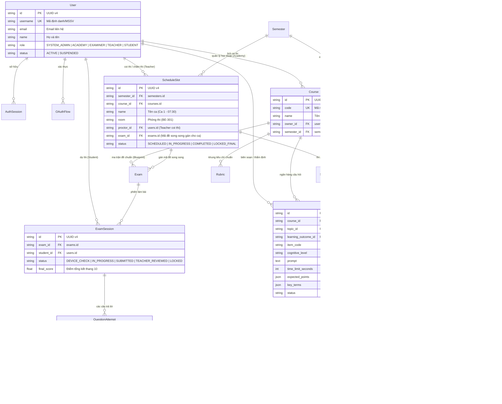

# ĐẶC TẢ THIẾT KẾ CƠ SỞ DỮ LIỆU (DATABASE ARCHITECTURE & DATA DICTIONARY)

> **Dự án:** AI Oral Assessment Platform (Hệ thống Thi vấn đáp Tự động bằng AI)  
> **Chủ sở hữu:** Nguyễn Văn Gia Bình — NCKH / Đồ án Tốt nghiệp  
> **Khung chuẩn lý thuyết:** Khung 12 bước của Steven M. Downing (Educational Measurement)  
> **Hệ quản trị CSDL:** PostgreSQL 16  
> **Lưu trữ nhị phân (Object Storage):** MinIO S3 (Audio / Video bài thi và File mẫu)  
> **Bộ nhớ đệm (In-Memory Cache):** Redis 7 (Rate limiting, Celery task queue, Pub/Sub)  
> **ORM Framework:** SQLAlchemy 2.0 (Python 3.12+) & Migration qua Alembic  

---

## 1. TỔNG QUAN KIẾN TRÚC DỮ LIỆU & RÀNG BUỘC TOÀN CỤC

Cơ sở dữ liệu của hệ thống được thiết kế theo chuẩn **3NF (Third Normal Form)**, kết hợp linh hoạt với các trường `JSONB` có cấu trúc phục vụ việc đóng băng đề thi (**Exam Snapshot Versioning**) và lắp ráp đề tự động (**Automated Test Assembly - ATA**).

### 1.1. Các nguyên tắc kiến trúc dữ liệu cốt lõi (Data Architectural Invariants)
1. **Server là Source of Truth:** Toàn bộ điểm số, phiên thi (`exam_sessions`), câu hỏi và kết quả thẩm định đều được tính toán và kiểm soát tập trung tại server.
2. **Khóa chính chuẩn hóa (UUID v4):** 100% các bảng kế thừa lớp cơ sở `Entity` đều sử dụng khóa chính UUID v4 dạng chuỗi 36 ký tự (`String(36)`) kèm thời gian khởi tạo Unix epoch (`created_at: Float`) giúp phân tán dữ liệu và chống đoán ID.
3. **Phân định 4 Vai trò Đại học Chuẩn mực:** Bảng `users` hỗ trợ 5 vai trò phân cấp rõ ràng: `ACADEMY` (Ban Học thuật), `EXAMINER` (Khảo thí), `TEACHER` (Giảng viên coi thi & chấm thi), `STUDENT` (Sinh viên) và `SYSTEM_ADMIN` (Quản trị hệ thống).
4. **Zero AI Question Generation & Item Bank Centric:** 100% câu hỏi thi được quản lý trong bảng `question_items` có đầy đủ mã câu, chuẩn đầu ra (LO), mức nhận thức Bloom, điểm mấu chốt (`expected_points`) và từ khóa (`key_terms`).
5. **Đóng băng tri thức (Freeze Snapshot v3):** Khi ca thi hoặc mã đề được kích hoạt, toàn bộ câu hỏi rút trích từ Item Bank, danh sách tiêu chí Rubric và cấu hình model AI tại thời điểm đó được copy nguyên trạng vào cột `Exam.snapshot` (JSON). Mọi thay đổi sau đó không làm sai lệch kết quả chấm của các bài thi đã công bố.
6. **Không tin tưởng Client (Anti-Tampering):** Máy trạm sinh viên chỉ đẩy các mảnh file âm thanh thô 4MB có băm SHA-256 lên MinIO. Bảng `uploads` lưu trữ hash và trạng thái upload; bảng `question_attempts` lưu transcript do Faster-Whisper Server-Side Worker tự động bóc băng từ MinIO (Zero-STT Client).

---

## 2. SƠ ĐỒ THỰC THỂ LIÊN KẾT TỔNG THỂ (ENTITY-RELATIONSHIP DIAGRAM - ERD)



---

## 3. PHÂN CỤM DỮ LIỆU THEO MIỀN NGHIỆP VỤ (DOMAIN DECOMPOSITION)

Cơ sở dữ liệu gồm **24 bảng**, được phân chia theo 4 khối trách nhiệm rõ ràng:

```
[HỆ THỐNG CƠ SỞ DỮ LIỆU POSTGRESQL 16]
 ├── KHỐI 1: TÀI KHOẢN, PHÂN QUYỀN & XÁC THỰC (IAM)
 │     ├── users (Role: SYSTEM_ADMIN, ACADEMY, EXAMINER, TEACHER, STUDENT)
 │     ├── auth_sessions (Quản lý JWT & Logout)
 │     └── oauth_flows (Google OIDC PKCE)
 │
 ├── KHỐI 2: BAN HỌC THUẬT - MÔN HỌC, CHUẨN ĐẦU RA & ITEM BANK (Academy Domain)
 │     ├── courses (Master Course Catalog)
 │     ├── learning_outcomes (Chuẩn đầu ra LO)
 │     ├── topics (Cây chủ đề môn học)
 │     ├── rubrics (Khung tiêu chí chấm chuẩn)
 │     ├── question_items (Ngân hàng câu hỏi thẩm định - Item Bank)
 │     └── topic_outcomes (Bảng liên kết N-N giữa Topic và LO)
 │
 ├── KHỐI 3: PHÒNG KHẢO THÍ - HỌC KỲ, CA THI & MÃ ĐỀ SONG SONG (Examiner Domain)
 │     ├── semesters (Học kỳ: Fall_2026, Spring_2027...)
 │     ├── class_sections (Lớp học: SE1801, SE1802...)
 │     ├── section_students (Sinh viên theo lớp)
 │     ├── schedule_slots (Ca thi, phòng thi, giờ thi, giảng viên coi thi)
 │     ├── slot_students (Thí sinh được phân vào ca thi)
 │     ├── course_enrollments (Ghi danh môn học)
 │     └── exams (Ma trận chuẩn & Các mã đề song song sinh qua ATA)
 │
 └── KHỐI 4: THI VẤN ĐÁP, BẰNG CHỨNG & CHẤM ĐIỂM (Assessment & Evidence)
       ├── exam_sessions (Phiên thi trực tiếp của sinh viên)
       ├── question_attempts (Câu trả lời, transcript Faster-Whisper, điểm AI)
       ├── uploads (MinIO chunked evidence 4MB + SHA-256)
       ├── review_jobs (Hàng đợi phúc khảo / chấm chéo độc lập)
       ├── assignments (Cấp thêm lượt thi retake cá nhân)
       ├── audit_logs (Nhật ký kiểm toán thao tác hệ thống)
       └── system_settings (Cấu hình LLM/Whisper/MinIO động)
```

---

## 4. TỪ ĐIỂN DỮ LIỆU CHI TIẾT (DATA DICTIONARY)

### 4.1. Khối 1: Tài khoản & Phân quyền (IAM)

#### 1. Bảng `users` (Quản lý người dùng toàn hệ thống)
| Tên trường | Kiểu dữ liệu | Khóa / Ràng buộc | Giá trị mặc định | Diễn giải nghiệp vụ |
| :--- | :--- | :---: | :---: | :--- |
| `id` | `VARCHAR(36)` | **PK** | UUID v4 | Khóa chính định danh người dùng. |
| `username` | `VARCHAR(80)` | **UNIQUE, NOT NULL** | — | Tên đăng nhập hoặc Mã số sinh viên (MSSV, ví dụ: `SE180001`). |
| `email` | `VARCHAR(320)` | `NULLABLE` | `NULL` | Hòm thư điện tử liên hệ hoặc SSO Google. |
| `google_sub` | `VARCHAR(255)` | **UNIQUE, NULLABLE** | `NULL` | Mã định danh người dùng từ Google OIDC (`sub` claim). |
| `name` | `VARCHAR(150)` | `NOT NULL` | — | Họ và tên hiển thị đầy đủ. |
| `password_hash`| `TEXT` | `NOT NULL` | — | Mật khẩu băm an toàn chuẩn **Argon2id**. |
| `role` | `VARCHAR(20)` | `NOT NULL` | `'STUDENT'` | 1 trong 5 vai trò chuẩn: `SYSTEM_ADMIN`, `ACADEMY`, `EXAMINER`, `TEACHER`, `STUDENT`. |
| `status` | `VARCHAR(20)` | `NOT NULL` | `'ACTIVE'` | Trạng thái tài khoản: `ACTIVE`, `SUSPENDED`. |
| `created_at` | `DOUBLE PRECISION`| `NOT NULL` | `time.time()` | Thời điểm tạo tài khoản. |

---

### 4.2. Khối 2: Ban Học thuật & Ngân hàng câu hỏi (Academy Domain)

#### 2. Bảng `courses` (Danh mục môn học)
| Tên trường | Kiểu dữ liệu | Khóa / Ràng buộc | Giá trị mặc định | Diễn giải nghiệp vụ |
| :--- | :--- | :---: | :---: | :--- |
| `id` | `VARCHAR(36)` | **PK** | UUID v4 | Khóa chính của môn học. |
| `code` | `VARCHAR(50)` | **UNIQUE, NOT NULL** | — | Mã môn học chuẩn (Ví dụ: `CSD201`, `PRN211`). |
| `name` | `VARCHAR(200)`| `NOT NULL` | — | Tên môn học đầy đủ. |
| `description`| `TEXT` | `NOT NULL` | `''` | Mô tả môn học và mục tiêu đào tạo. |
| `credits` | `INTEGER` | `NOT NULL` | `3` | Số tín chỉ của môn học. |
| `owner_id` | `VARCHAR(36)` | **FK -> users.id** | `NULL` | Cán bộ Ban Học thuật phụ trách môn (`ACADEMY`). |
| `semester_id`| `VARCHAR(36)` | **FK -> semesters.id**| `NULL` | Học kỳ mở môn (nếu là môn mở trong kỳ). |
| `status` | `VARCHAR(20)` | `NOT NULL` | `'ACTIVE'` | Trạng thái môn: `ACTIVE`, `ARCHIVED`. |
| `created_at` | `DOUBLE PRECISION`| `NOT NULL` | `time.time()` | Ngày tạo môn học. |

#### 3. Bảng `learning_outcomes` (Chuẩn đầu ra môn học - LO)
| Tên trường | Kiểu dữ liệu | Khóa / Ràng buộc | Giá trị mặc định | Diễn giải nghiệp vụ |
| :--- | :--- | :---: | :---: | :--- |
| `id` | `VARCHAR(36)` | **PK** | UUID v4 | Khóa chính chuẩn đầu ra. |
| `course_id` | `VARCHAR(36)` | **FK -> courses.id** | — | Môn học chứa chuẩn đầu ra. |
| `code` | `VARCHAR(50)` | `NOT NULL` | — | Mã chuẩn đầu ra (Ví dụ: `LO1`, `LO2`, `LO3`). |
| `description`| `TEXT` | `NOT NULL` | — | Mô tả chi tiết năng lực sinh viên cần đạt được. |
| `weight` | `DOUBLE PRECISION`| `NOT NULL` | `1.0` | Trọng số trong cấu trúc đánh giá. |
| `created_at` | `DOUBLE PRECISION`| `NOT NULL` | `time.time()` | Thời điểm tạo LO. |
| *Constraint* | `UNIQUE` | `(course_id, code)` | — | Trong 1 môn học, mã LO không được trùng lặp. |

#### 4. Bảng `topics` (Cây chủ đề môn học)
| Tên trường | Kiểu dữ liệu | Khóa / Ràng buộc | Giá trị mặc định | Diễn giải nghiệp vụ |
| :--- | :--- | :---: | :---: | :--- |
| `id` | `VARCHAR(36)` | **PK** | UUID v4 | Khóa chính của chủ đề. |
| `course_id` | `VARCHAR(36)` | **FK -> courses.id** | — | Môn học chứa chủ đề. |
| `name` | `VARCHAR(200)`| `NOT NULL` | — | Tên chủ đề (Ví dụ: "Cây nhị phân tìm kiếm", "Thuật toán Đồ thị"). |
| `description`| `TEXT` | `NOT NULL` | `''` | Mô tả nội dung kiến thức trọng tâm của chủ đề. |
| `created_at` | `DOUBLE PRECISION`| `NOT NULL` | `time.time()` | Thời điểm tạo chủ đề. |

#### 5. Bảng `question_items` (Ngân hàng câu hỏi thẩm định - Item Bank)
*Trung tâm lưu trữ câu hỏi thi do Ban Học thuật quản lý và thẩm định chuyên môn.*
| Tên trường | Kiểu dữ liệu | Khóa / Ràng buộc | Giá trị mặc định | Diễn giải nghiệp vụ |
| :--- | :--- | :---: | :---: | :--- |
| `id` | `VARCHAR(36)` | **PK** | UUID v4 | Khóa chính định danh câu hỏi. |
| `course_id` | `VARCHAR(36)` | **FK -> courses.id** | — | Môn học sở hữu câu hỏi (`ON DELETE CASCADE`). |
| `topic_id` | `VARCHAR(36)` | **FK -> topics.id** | `NULL` | Thuộc chủ đề kiến thức nào (`ON DELETE SET NULL`). |
| `learning_outcome_id` | `VARCHAR(36)` | **FK -> learning_outcomes.id** | `NULL` | Đo lường chuẩn đầu ra nào (`ON DELETE SET NULL`). |
| `item_code` | `VARCHAR(50)` | `NULLABLE` | `NULL` | Mã câu hỏi sư phạm (Ví dụ: `ITEM_BST_015`, `CSD_GR_008`). |
| `cognitive_level` | `VARCHAR(30)` | `NOT NULL` | `'UNDERSTAND'` | Mức nhận thức Bloom: `REMEMBER`, `UNDERSTAND`, `APPLY`, `ANALYZE`. |
| `prompt` | `TEXT` | `NOT NULL` | — | **Nội dung câu hỏi thi vấn đáp** mà sinh viên nghe/đọc. |
| `time_limit_seconds` | `INTEGER` | `NOT NULL` | `180` | Thời gian tối đa sinh viên được trả lời câu hỏi (giây). |
| `rubric_criterion_name` | `VARCHAR(200)`| `NULLABLE`| `NULL` | Tên tiêu chí Rubric tương ứng để chấm điểm câu này. |
| `expected_points` | `JSONB` | `NULLABLE` | `[]` | Danh sách các ý trả lời cốt lõi bắt buộc phải có để đạt điểm. |
| `key_terms` | `JSONB` | `NULLABLE` | `[]` | Mảng các thuật ngữ chuyên môn tiếng Anh/Việt bắt buộc xuất hiện. |
| `status` | `VARCHAR(20)` | `NOT NULL` | `'VERIFIED'` | Trạng thái: `DRAFT`, `VERIFIED` (đã thẩm định), `ACTIVE`, `ARCHIVED`. |
| `review_notes` | `TEXT` | `NULLABLE` | `NULL` | Ghi chú đánh giá của hội đồng thẩm định học thuật. |
| `created_by` | `VARCHAR(36)` | **FK -> users.id** | `NULL` | Cán bộ Học thuật biên soạn/import câu hỏi. |
| `created_at` | `DOUBLE PRECISION`| `NOT NULL` | `time.time()` | Thời điểm tạo câu hỏi. |

#### 6. Bảng `rubrics` (Khung tiêu chí đánh giá chuẩn môn)
| Tên trường | Kiểu dữ liệu | Khóa / Ràng buộc | Giá trị mặc định | Diễn giải nghiệp vụ |
| :--- | :--- | :---: | :---: | :--- |
| `id` | `VARCHAR(36)` | **PK** | UUID v4 | Khóa chính của Rubric. |
| `course_id` | `VARCHAR(36)` | **FK -> courses.id** | — | Môn học áp dụng khung tiêu chí này. |
| `name` | `VARCHAR(200)`| `NOT NULL` | — | Tên khung Rubric chuẩn (Ví dụ: "Rubric Vấn đáp CSD201 Chuẩn 2026"). |
| `version` | `INTEGER` | `NOT NULL` | `1` | Số phiên bản của Rubric. |
| `criteria` | `JSONB` | `NOT NULL` | — | Mảng JSON các tiêu chí đánh giá: `[{name, description, max_score, weight}]`. |
| `created_at` | `DOUBLE PRECISION`| `NOT NULL` | `time.time()` | Thời điểm khởi tạo Rubric. |

---

### 4.3. Khối 3: Khảo thí, Ca thi & Lắp ráp đề tự động (Examiner Domain)

#### 7. Bảng `semesters` (Học kỳ)
| Tên trường | Kiểu dữ liệu | Khóa / Ràng buộc | Giá trị mặc định | Diễn giải nghiệp vụ |
| :--- | :--- | :---: | :---: | :--- |
| `id` | `VARCHAR(36)` | **PK** | UUID v4 | Khóa chính học kỳ. |
| `name` | `VARCHAR(100)`| `NOT NULL` | — | Tên học kỳ (Ví dụ: "Fall 2026"). |
| `code` | `VARCHAR(50)` | **UNIQUE, NOT NULL** | — | Mã học kỳ chuẩn (Ví dụ: `FALL_2026`, `SPRING_2027`). |
| `start_date`| `VARCHAR(20)` | `NULLABLE` | `NULL` | Ngày bắt đầu học kỳ (YYYY-MM-DD). |
| `end_date` | `VARCHAR(20)` | `NULLABLE` | `NULL` | Ngày kết thúc học kỳ. |
| `status` | `VARCHAR(20)` | `NOT NULL` | `'ACTIVE'` | Trạng thái: `UPCOMING`, `ACTIVE`, `COMPLETED`. |
| `created_at` | `DOUBLE PRECISION`| `NOT NULL` | `time.time()` | Thời điểm tạo học kỳ. |

#### 8. Bảng `schedule_slots` (Ca thi / Lịch thi theo phòng)
*Đơn vị tổ chức thi cơ sở: Mỗi ca thi có thời gian, phòng thi, danh sách sinh viên và mã đề thi riêng.*
| Tên trường | Kiểu dữ liệu | Khóa / Ràng buộc | Giá trị mặc định | Diễn giải nghiệp vụ |
| :--- | :--- | :---: | :---: | :--- |
| `id` | `VARCHAR(36)` | **PK** | UUID v4 | Khóa chính ca thi. |
| `semester_id`| `VARCHAR(36)` | **FK -> semesters.id**| — | Thuộc học kỳ nào. |
| `course_id` | `VARCHAR(36)` | **FK -> courses.id** | — | Ca thi của môn học nào. |
| `name` | `VARCHAR(100)`| `NOT NULL` | — | Tên ca thi (Ví dụ: "Ca 1 - Sáng 15/10/2026"). |
| `slot_date` | `VARCHAR(20)` | `NOT NULL` | — | Ngày diễn ra ca thi (YYYY-MM-DD). |
| `start_time`| `VARCHAR(10)` | `NOT NULL` | — | Giờ bắt đầu (HH:MM, ví dụ: "07:30"). |
| `end_time` | `VARCHAR(10)` | `NOT NULL` | — | Giờ kết thúc (HH:MM, ví dụ: "09:00"). |
| `room` | `VARCHAR(50)` | `NOT NULL` | — | Phòng thi (Ví dụ: "BE-301", "Lab 4"). |
| `proctor_id`| `VARCHAR(36)` | **FK -> users.id** | `NULL` | Giảng viên được phân công coi thi (`TEACHER`). |
| `exam_id` | `VARCHAR(36)` | **FK -> exams.id** | `NULL` | **Mã đề thi song song gán riêng cho ca thi này.** |
| `max_students`| `INTEGER` | `NOT NULL` | `30` | Sức chứa tối đa của ca thi. |
| `status` | `VARCHAR(20)` | `NOT NULL` | `'SCHEDULED'` | Trạng thái: `SCHEDULED`, `IN_PROGRESS`, `COMPLETED`, `LOCKED_FINAL`. |
| `created_at` | `DOUBLE PRECISION`| `NOT NULL` | `time.time()` | Thời điểm tạo ca thi. |

#### 9. Bảng `exams` (Ma trận chuẩn & Mã đề thi song song)
| Tên trường | Kiểu dữ liệu | Khóa / Ràng buộc | Giá trị mặc định | Diễn giải nghiệp vụ |
| :--- | :--- | :---: | :---: | :--- |
| `id` | `VARCHAR(36)` | **PK** | UUID v4 | Khóa chính định danh đề thi. |
| `course_id` | `VARCHAR(36)` | **FK -> courses.id** | — | Môn học sở hữu đề thi. |
| `rubric_id` | `VARCHAR(36)` | **FK -> rubrics.id** | — | Khung Rubric chuẩn dùng để chấm điểm. |
| `name` | `VARCHAR(200)`| `NOT NULL` | — | Tên đề / Tên mã đề (Ví dụ: "CSD201 Final Exam - Variant 101"). |
| `time_limit` | `INTEGER` | `NOT NULL` | — | Tổng thời gian làm bài (tính bằng giây). |
| `blueprint` | `JSONB` | `NULLABLE` | `NULL` | Ma trận chuẩn: quy định số câu, LO, Topic, Bloom Level, điểm số. |
| `status` | `VARCHAR(20)` | `NOT NULL` | `'DRAFT'` | Trạng thái: `DRAFT`, `PUBLISHED`, `ARCHIVED`. |
| `snapshot` | `JSONB` | `NULLABLE` | `NULL` | **Snapshot Đóng Băng v3:** Chứa toàn bộ câu hỏi rút từ Item Bank, barem chấm, expected points, rubric và cấu hình model AI. |
| `max_attempts`| `INTEGER` | `NOT NULL` | `1` | Số lần làm bài tối đa mặc định cho sinh viên. |
| `created_at` | `DOUBLE PRECISION`| `NOT NULL` | `time.time()` | Thời điểm tạo đề thi. |

---

### 4.4. Khối 4: Thi vấn đáp, Bằng chứng & Chấm điểm (Assessment & Evidence)

#### 10. Bảng `exam_sessions` (Phiên làm bài thi trực tiếp của Sinh viên)
| Tên trường | Kiểu dữ liệu | Khóa / Ràng buộc | Giá trị mặc định | Diễn giải nghiệp vụ |
| :--- | :--- | :---: | :---: | :--- |
| `id` | `VARCHAR(36)` | **PK** | UUID v4 | Khóa chính phiên thi. |
| `exam_id` | `VARCHAR(36)` | **FK -> exams.id** | — | Mã đề thi sinh viên đang làm. |
| `student_id`| `VARCHAR(36)` | **FK -> users.id** | — | Sinh viên đang dự thi. |
| `status` | `VARCHAR(30)` | `NOT NULL` | `'DEVICE_CHECK'`| Vòng đời: `DEVICE_CHECK`, `IN_PROGRESS`, `SUBMITTED`, `AI_SCORED`, `TEACHER_REVIEWED`, `LOCKED_FINAL`. |
| `attempt_number` | `INTEGER` | `NOT NULL` | `1` | Số thứ tự lần thi của sinh viên. |
| `final_score`| `DOUBLE PRECISION`| `NULLABLE`| `NULL` | Điểm tổng kết cuối cùng của bài thi (thang điểm 10.0). |
| `started_at` | `DOUBLE PRECISION`| `NULLABLE` | `NULL` | Thời điểm thực sự bấm bắt đầu làm bài. |
| `completed_at`| `DOUBLE PRECISION`| `NULLABLE`| `NULL` | Thời điểm nộp bài thành công. |
| `deleted_at` | `DOUBLE PRECISION`| `NULLABLE` | `NULL` | Thời điểm hủy phiên thi lỗi (soft delete). |
| `created_at` | `DOUBLE PRECISION`| `NOT NULL` | `time.time()` | Thời điểm tạo phiên thi. |

#### 11. Bảng `question_attempts` (Chi tiết trả lời từng câu hỏi)
| Tên trường | Kiểu dữ liệu | Khóa / Ràng buộc | Giá trị mặc định | Diễn giải nghiệp vụ |
| :--- | :--- | :---: | :---: | :--- |
| `id` | `VARCHAR(36)` | **PK** | UUID v4 | Khóa chính câu trả lời. |
| `session_id` | `VARCHAR(36)` | **FK -> exam_sessions.id** | — | Thuộc phiên làm bài nào. |
| `sequence` | `INTEGER` | `NOT NULL` | — | Số thứ tự câu hỏi trong đề (1, 2, 3...). |
| `question` | `JSONB` | `NOT NULL` | — | Bản sao câu hỏi trích từ Snapshot đề thi. |
| `status` | `VARCHAR(30)` | `NOT NULL` | `'READY'` | Trạng thái: `READY`, `ANSWERING`, `SUBMITTED`, `EVALUATING`, `COMPLETED`. |
| `transcript` | `TEXT` | `NULLABLE` | `NULL` | Bản bóc băng do Faster-Whisper Server phiên âm từ audio MinIO. |
| `stt_confidence` | `DOUBLE PRECISION` | `NULLABLE` | `NULL` | Điểm tự tin của mô hình nhận diện giọng nói (0.0 đến 1.0). |
| `assessment` | `JSONB` | `NULLABLE` | `NULL` | Kết quả chấm AI: `{score, criteria_scores, feedback, reasoning, confidence_score}`. |
| `started_at` | `DOUBLE PRECISION`| `NULLABLE` | `NULL` | Bắt đầu trả lời câu hỏi. |
| `finished_at`| `DOUBLE PRECISION`| `NULLABLE` | `NULL` | Dừng ghi âm và nộp câu. |
| `created_at` | `DOUBLE PRECISION`| `NOT NULL` | `time.time()` | Thời điểm khởi tạo câu hỏi. |

#### 12. Bảng `uploads` (Bằng chứng âm thanh lưu trên MinIO S3)
| Tên trường | Kiểu dữ liệu | Khóa / Ràng buộc | Giá trị mặc định | Diễn giải nghiệp vụ |
| :--- | :--- | :---: | :---: | :--- |
| `id` | `VARCHAR(36)` | **PK** | UUID v4 | Khóa chính phiên upload. |
| `attempt_id` | `VARCHAR(36)` | **FK -> question_attempts.id** | — | Gắn với câu trả lời nào. |
| `kind` | `VARCHAR(10)` | `NOT NULL` | — | Định dạng: `AUDIO` hoặc `VIDEO`. |
| `mime_type` | `VARCHAR(100)`| `NOT NULL` | — | MIME chuẩn (`audio/webm;codecs=opus`). |
| `size` | `INTEGER` | `NOT NULL` | — | Dung lượng tệp nguyên bản (bytes). |
| `sha256` | `VARCHAR(64)` | `NOT NULL` | — | **Mã băm SHA-256 toàn vẹn:** Chứng minh tệp không bị sửa đổi. |
| `total_chunks` | `INTEGER` | `NOT NULL` | — | Số lượng phân mảnh 4MB tải lên từ Student App. |
| `status` | `VARCHAR(20)` | `NOT NULL` | `'PENDING'` | Trạng thái upload: `PENDING`, `UPLOADING`, `COMPLETED`, `FAILED`. |
| `storage_key`| `TEXT` | `NULLABLE` | `NULL` | Đường dẫn Object trên MinIO S3 (`attempts/{id}/audio.webm`). |
| `created_at` | `DOUBLE PRECISION`| `NOT NULL` | `time.time()` | Thời điểm bắt đầu tải lên. |
