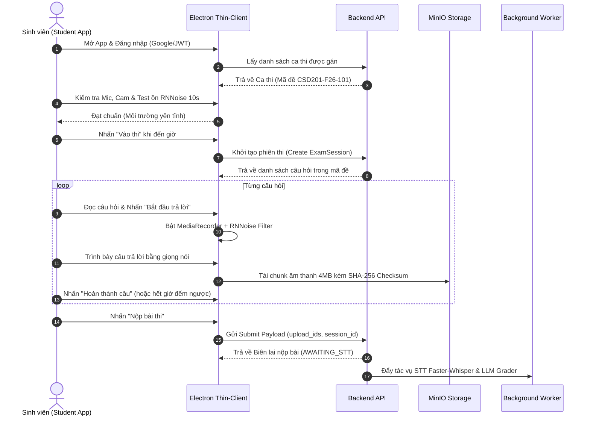

# Actor: Sinh viên (Student)

## 1. Actor Profile

| Thuộc tính | Mô tả |
| :--- | :--- |
| **Vai trò (Role)** | `STUDENT` |
| **Mô tả** | Thí sinh tham gia kỳ thi vấn đáp trên máy tính cá nhân thông qua ứng dụng desktop chuyên dụng (Student App Thin-Client). Sinh viên chỉ được dự thi các ca thi và mã đề mà Phòng Khảo thí đã phân bổ. |
| **Thiết bị & Môi trường** | Máy tính cá nhân chạy Windows / macOS / Linux với ứng dụng Electron, trang bị tai nghe kèm microphone đạt chuẩn và camera. |
| **Phạm vi quyền hạn** | Kiểm tra thiết bị, kiểm tra độ ồn môi trường, tham gia ca thi đúng giờ quy định, trả lời các câu hỏi thi bằng giọng nói, nộp bài thi, xem kết quả và gửi đơn phúc khảo khi được mở cổng. |
| **Nguyên tắc cốt lõi** | **"Trung thực - Minh bạch - Không can thiệp"**: Sinh viên chỉ trả lời bằng giọng nói trực tiếp, không sử dụng bàn phím hay chat text. Toàn bộ file âm thanh và video được tải trực tiếp lên MinIO làm bằng chứng pháp lý bất biến. Sinh viên không được xem hay sửa transcript trên máy client. |

---

## 2. User Stories

### US-STUDENT-001: Đăng nhập vào Ứng dụng Desktop Thin-Client
> **As a** Sinh viên  
> **I want to** đăng nhập bằng tài khoản trường cấp (hoặc tài khoản Google FPT OIDC) trên ứng dụng Desktop  
> **So that** hệ thống xác thực danh tính và tải danh sách các ca thi của tôi.

### US-STUDENT-002: Kiểm tra thiết bị và Đo độ ồn môi trường (Pre-exam Device Check)
> **As a** Sinh viên  
> **I want to** kiểm tra tín hiệu microphone, camera và thực hiện bài đo độ ồn môi trường 10 giây (qua bộ lọc chống nhiễu RNNoise WASM)  
> **So that** bảo đảm môi trường xung quanh đủ yên tĩnh và âm thanh thu âm đạt chuẩn chất lượng cho hệ thống bóc băng.

### US-STUDENT-003: Vào phòng thi theo Ca thi được Khảo thí xếp lịch
> **As a** Sinh viên  
> **I want to** xem danh sách các ca thi của mình (tên môn, ngày thi, khung giờ, phòng thi, trạng thái: Chờ thi, Đang diễn ra, Đã hoàn thành) và bấm "Vào phòng thi" khi đến giờ quy định  
> **So that** tôi tham gia đúng ca thi và nhận đúng mã đề thi của ca đó.

### US-STUDENT-004: Làm bài thi vấn đáp theo từng câu hỏi (Audio-only)
> **As a** Sinh viên  
> **I want to** đọc câu hỏi trên màn hình, xem thời gian đếm ngược trả lời (ví dụ 180 giây), bấm "Bắt đầu trả lời" và nói vào micro  
> **So that** tôi trình bày câu trả lời của mình một cách tự nhiên và liên tục.

### US-STUDENT-005: Tải âm thanh an toàn qua Chunked Upload (MinIO S3)
> **As a** Sinh viên  
> **I want to** hệ thống tự động băm nhỏ âm thanh thành các đoạn 4MB có mã băm toàn vẹn SHA-256 và tải trực tiếp lên MinIO trong quá trình thi  
> **So that** bài thi không bao giờ bị mất dữ liệu kể cả khi xảy ra sự cố chập chờn mạng tại phòng thi.

### US-STUDENT-006: Nộp bài thi và Xác nhận biên lai nộp bài
> **As a** Sinh viên  
> **I want to** bấm nộp bài sau khi trả lời hết các câu hỏi (hoặc hệ thống tự động nộp khi hết giờ) và nhận mã biên lai nộp bài thành công (Submission Receipt)  
> **So that** tôi an tâm bài thi của mình đã được máy chủ ghi nhận trọn vẹn.

### US-STUDENT-007: Xem kết quả bài thi và Nhận xét chi tiết
> **As a** Sinh viên  
> **I want to** xem điểm tổng kết, điểm thành phần theo từng tiêu chí Rubric, nhận xét chi tiết của giảng viên và lời phê của AI sau khi Phòng Khảo thí công bố kết quả  
> **So that** tôi hiểu rõ điểm mạnh, điểm yếu và mức độ đạt chuẩn đầu ra (LO) của bản thân.

### US-STUDENT-008: Gửi đơn yêu cầu Phúc khảo bài thi
> **As a** Sinh viên  
> **I want to** gửi yêu cầu phúc khảo kèm lý do cụ thể trong thời hạn quy định nếu cảm thấy điểm số chưa phản ánh đúng phần trả lời của mình  
> **So that** Phòng Khảo thí điều phối giảng viên thứ hai chấm chéo độc lập từ bản ghi âm minh chứng.

---

## 3. Quy trình làm bài thi của Sinh viên (Step-by-Step Flow)

